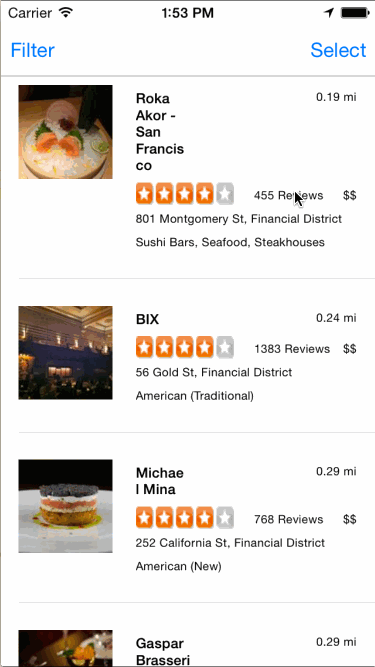

# YelpBest

Description:
1. menu identification from reviews using natural language processing and machine learning techniques
2. provides statistics on popularity of each dish per restaurant
3. when you are at a restaurant, we recommend you what to eat based on other people's reviews
4. users can also upvote/downvote the dish interactively
 
 Benefits:
 1. meet users' needs for food recommendation
 2. possible integration with local search/fastbreak/Y!Index
 3. help with current Yahoo data's two headaches - encourage users to share location (popular restaurant/dishes near you) and log in (recommend dish/restaurants based on votes on previous dishes)!

